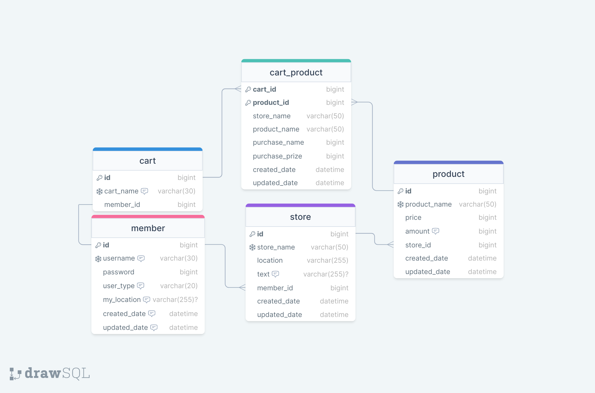

#주문 앱 

## 프로젝트 기능 및 설계

- **회원가입 기능**
    * 회원가입은 2가지 종류가 있다. 매장 점장이 가입하는 ADMIN, 고객이 가입하는 USER가 존재한다.
    * 아이디와 패스워드를 입력해 인증을 시도한다.

    
- **로그인 기능**
    * 로그인에 성공할 경우 JWT 토큰을 발급 받아 이를 HEADER에 넣어 요청을 보낸다.

- **보안 기능**
    * 필터에서 User-Password 인증방식 이전에 JWT 토큰 인증 방식을 먼저 채택해 요청을 처리한다.
    * 각 API 경로에 ADMIN, USER가 접근할 수 있는 권한을 부여한다.
    * Password를 해시화해서 유저정보를 저장한다.

- **장바구니 기능**
    * 상품 담기 기능  
      * 주문 하려는 상품을 장바구니에 저장한다.
    * 장바구니 조회 기능
      * 현재 장바구니에 들어있는 품목을 볼 수 있다.
      * 장바구니에 들어있는 품목의 총 가격을 확인 할 수 있다. 
    * 장바구니 상품 삭제 기능
      * 현재 들어있는 장바구니의 개별 품목을 삭제 할 수 있다.
      * 현재 들어있는 장바구니의 모든 품목을 삭제 할 수 있다.
    * 장바구니 상품 구매 기능 
      * 현재 들어있는 품목을 구매할 수 있다.(+ 체크된 상품만 구매), (+ 배달, 포장 선택)

- **(관리자) 매장 관리 기능**
    * 매장 등록 기능 
      * 자기 매장을 앱에 등록할 수 있다. 매장 이름은 unique 하다. 
    * 매장 정보 수정 기능
      * 매장 이름을 제외한 매장 정보를 수정 할 수 있다.
    * 매장 해지 기능
      * 앱에서 매장을 해지할 수 있다.

- **(관리자) 상품 관리 기능**
    * 상품 등록 기능 
      * 상품 이름과 가격을 등록 할 수 있다.상품 이름은 unique 하다. (+ 된다면 수량도)
    * 상품 정보 수정 기능 
      * 상품 이름을 제외한 정보를 수정 할 수 있다. 
    * 상품 정보 삭제 기능
      * 상품 정보를 삭제할 수 있다. 
    * 상품 조회 기능(USER 가능)
      * 상품 정보를 확인 할 수 있다.

- **Keyword 검색 기능**
    * 특정 문자열이 들어가는 매장 정보를 전부 확인 할 수 있다.
    * 특정 문자열이 들어가는 상품 정보를 전부 확인 할 수 있다.

## ERD 모델링

## Trouble Shooting
[go to the trouble shooting section](../docs/TROUBLE_SHOOTING.md)

## 이후 추가해 볼 것

- **캐시 사용**
    * 유저 인증정보를 짧은 시간 캐시로 저장한다.
    * 조회한 상품을 캐시로 저장한다.
    * DB에 정보 삭제시 캐시도 함께 삭제해야한다.

- **구매 기능**
    * 한 종류만 구매할 경우 바로 구매할 수 있는 기능을 제공한다.

- **배달 기능**
    * 주문완료 시 자동으로 배달이 접수된다.
    * 매장과의 거리에 따라 배달비와 시간이 산정된다. 
    * 거리 계산은 USER Entity의 좌표와 매장의 좌표로 계산한다.(위치 좌표로 저장)
    * 네이버 지도의 Api를 활용해서 거리와 배달비를 산정한다.(문자열로 저장)    

- **Open Api**
    * GPT Api를 활용해본다.